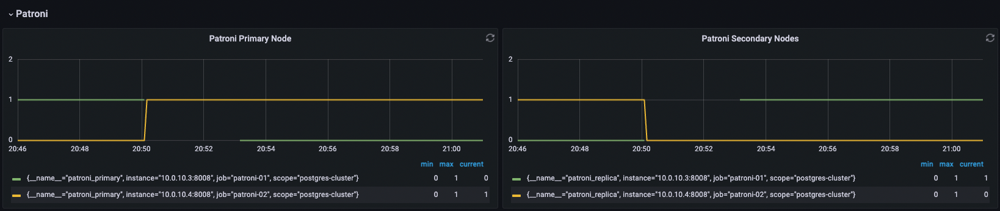
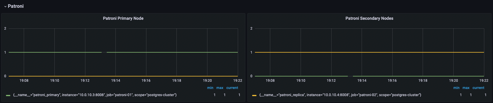
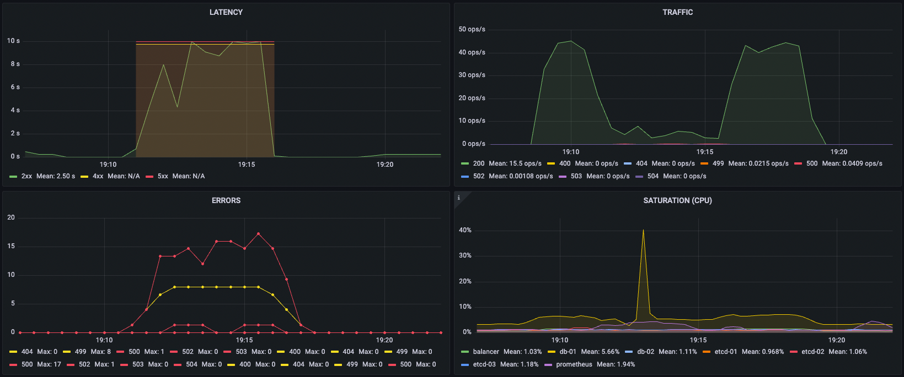
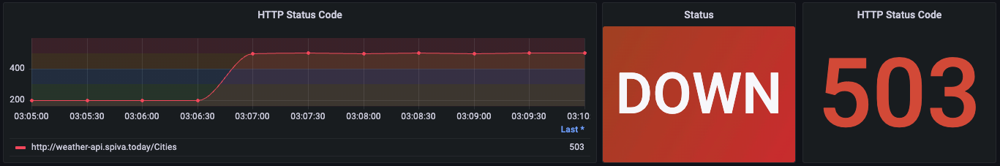
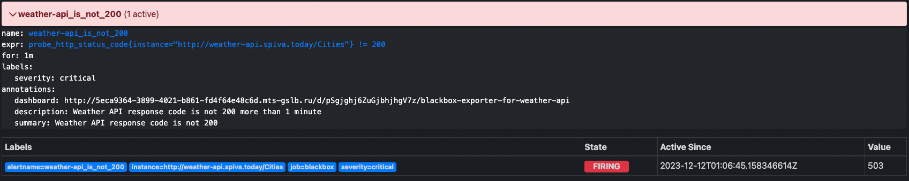
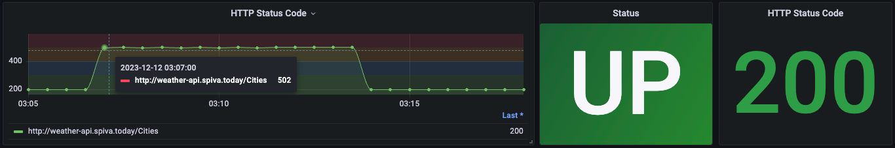
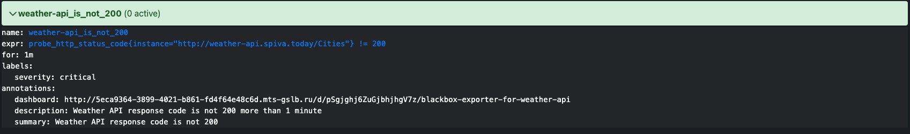

# Домашнее задание №4 по курсу "SRE: Cтратегия и методы" от МТС.Тета

## Идентификационные данные

Имя проекта: Проект для студента igor.shokhov

Namespace: sre-cource-student-114

## Описание

В этом репозитории содержатся описание экспериментов по Chaos Engineering над инфраструктурой учебного проекта weather-api и их результаты.

## Задачи

### Отключение узла

#### _Описание эксперимента_

Пробуем отключить мастер-узел Patroni кластера БД на 4 минуты и наблюдаем, как такое отключение повлияет на работоспособность сервиса.

#### _Ожидаемые результаты_

Ожидаем, что отключение мастер-узла в кластере из двух нод не повлияет на работу кластера, так как Patroni поменяет лидера с репликой местами и корректная работа продолжится, а после повторного включения отключенного узла, он становится репликой. Штатная обработка запросов при этом прерываться не должна.

#### _Реальные результаты_

Перед самым началом эксперимента была подана стабильная нагрузка на эндпоинт /Cities API на чтение/запись. Судя по графикам мониторинга, смена лидерства произошла буквально за несколько секунд, также как и назначение реплики после включения узла обратно. Первые пару минут с момента смены лидера наблюдалась отдача 500 ошибок на часть запросов.



#### _Анализ результатов_

Результаты эксперимента показали, что реальный результат не совпал с ожидаемым. Стабильная работа API была нарушена и часть запросов не было обработано должным образом. В целом результат получился похожим на то, как ведёт себя сервис под высокой нагрузкой.

---

### Имитация частичной потери сети

#### _Описание эксперимента_

Пробуем имитировать потерю 50% пакетов в течение 5 минут для нарушения стабильной связанности между узлами кластера БД и наблюдаем, насколько хорошо система справляется с временной недоступностью узлов и как быстро восстанавливается репликация. Для создания условий эксперимента воспользуемся утилитой ChaosBlade:

```
root@pgnode01:~/chaosblade-1.7.2# ./blade create network loss --percent 50 --interface ens160 --timeout 300
{"code":200,"success":true,"result":"7cbe7caa1150b5ea"}
```

#### _Ожидаемые результаты_

Ожидаем, что потеря пакетов не скажется на процессе чтения/записи данных в БД и наш проект продолжит свою корректную работу, а при стабилизации связанности реплика догонит мастер.

#### _Реальные результаты_

Перед самым началом эксперимента была подана стабильная нагрузка на эндпоинт /Cities API на чтение/запись. Судя по графикам мониторинга, в первую же минуту начала имитации потери пакетов сервис стал отдавать 500 и 502 ошибки на часть запросов. Также сильно увеличилось среднее время ответа на запросы. В пике время ответа достигало 10 секунд. Также примерно 25 секунд наблюдался процесс активного флаппинга мастер-ноды БД в кластере, но процедура смены Patroni-лидера инициирована не была.



#### _Анализ результатов_

Результаты эксперимента показали, что реальный результат не совпал с ожидаемым. Стабильная работа API была нарушена и часть запросов не было обработано должным образом. В целом результат получился похожим на то, как ведёт себя сервис под высокой нагрузкой.

---

### Высокая нагрузка на CPU или I/O

#### _Описание эксперимента_

Пробуем сгенерировать 75% нагрузку на CPU мастер-узла Patroni кластера БД на 5 минут и наблюдаем, как такое отключение повлияет на работоспособность сервиса. Для создания условий эксперимента воспользуемся утилитой ChaosBlade:

```
root@pgnode02:~/chaosblade-1.7.2# ./blade create cpu load --cpu-percent 75 --timeout 300
{"code":200,"success":true,"result":"8e700b4a47153e06"}
```

#### _Ожидаемые результаты_

Ожидаем, что такая нагрузка не вызовет проблем в работе кластера БД и не повлияет на стабильность работы сервиса.

#### _Реальные результаты_

Перед самым началом эксперимента была подана стабильная нагрузка на эндпоинт /Cities API на чтение/запись. Судя по графикам мониторинга, возросшая нагрузка на CPU мастер-узла кластера БД не повлияла на качество предоставляемого сервиса – все запросы к API были обработаны без проблем.


#### _Анализ результатов_

Результаты эксперимента показали, что реальный результат совпал с ожидаемым.

---

### Тестирование систем мониторинга и оповещения

#### _Описание эксперимента_

Пробуем сымитировать какое-либо событие, которое является триггером для срабатывания системы мониторинга. Например, сделаем так, чтобы сработал алерт, настроенный при помощи метрики Blackbox exporter на отсутствие ответов с кодом 200 на GET-запросы к эндпоинту /Cities в течение минуты и более.

#### _Ожидаемые результаты_

Ожидаем, что в случае, если на GET-запросы к эндпоинту /Cities в течение минуты и более будут возвращаться ответы с кодом, отличным от 200, то за минуту соответствующий алерт перейдёт в статус firing и в течение следующей минуты будет отправлено уведомление с описанием возникшей проблемы в Telegram. Когда проблема будет исправлена и вновь пойдут ответы с 200 кодом, то алерт снова перейдёт в неактивное состояние.

#### _Реальные результаты_

Судя по графикам мониторинга, в течение минуты после того, как на контролируемые мониторингом запросы перстали приходить ответы с кодом 200, соответствующий алерт в Prometheus перешёл в статус firing:



И следом было получено следующее уведомление в Telegram:


После завершения эксперимента, алерт вновь стал неактивным:



#### _Анализ результатов_

Результаты эксперимента показали, что реальный результат совпал с ожидаемым.
